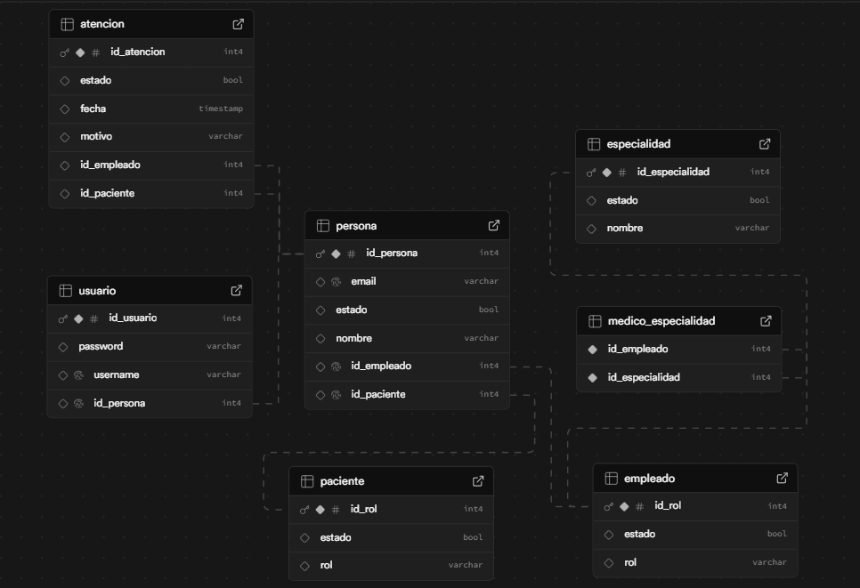

# insaludPrueba Técnica - Practicante TI

## Arquitectura y Diseño del Código

Proyecto estructurarse segun el patrón de diseño Modelo-Vista-Controlador (MVC)

- Modelos
- Servicios
- Controladores
- DTOs
- Respositorios

## Modelo de Datos

## Tecnologias

- Springboot
- Spring Security
- JPA
- Lombok
- Swagger
- Postgres
- Supabase

### Prueba el proyecto

1. Primero debes descargar el repositorio y clonarlo en tu local
2. Dirigete a la rama development
3. Correo el proyecto y dririgete a http://localhost:8083/swagger-ui.html
4. Ingresa las credenciales por defecto para autenticacion usuario: admin, contraseña: 123456
5. Prueba los endpoints (disponibles temporalemnte)